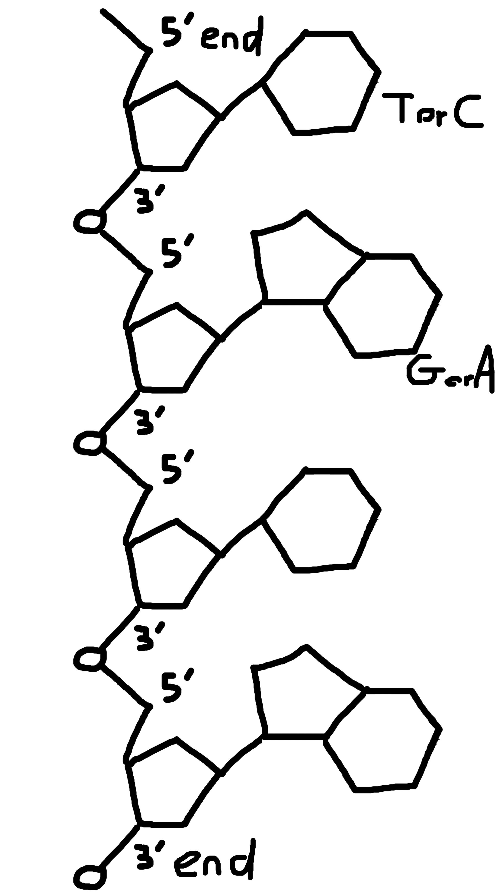

# Revisions for test

## Basic info

DNA = deoxyribonucleic acid

3 nucleotides (parts)
- 1 sugar molecule (deoxyribose)
- 1 phosphoric acid or phosphate
- Nitrogenous base
  - Adenine
  - Thymine
  - Cytosine
  - Guanine
  - A&T bond and C&G bond

## Nitrogenous bases

| Nitrogenous <br> Bases | 1 hexagon | 2 hexagons
|-|-|-|
| 2 bonds | T | A |
| 3 bonds | C | G |

| | 1 | 2 |
|-|-|-|
| 2 | T | A |
| 3 | C | G |

## DNA Diagram

<br>



## Other info

The bond between phosphoric acid and 3' of sugar is a **phosphodiester bond**.

Complete sequence on DNA is called a **genome**. A **gene** is a specific fragment in a genome containing a specific coded message.

DNA gets packed around histones

## DNA Replication - the enzymatic process

A prior necessity to Mitosis.

Before dividing, the cell must make identical copies of its DNA, it does this during the S phase.

DNA replication is semi-conservative.
```
| |             |  ||     |  ||
| | duplication |  ||     |  ||
| |   ------>   |  ||  +  |  ||
| |             |  ||     |  ||
| |             |  ||     |  ||

|  = original
|| = copy
```

To duplicate, the DNA "unzips" (original double helix splits, and a new parallel strand is built), enzymes do this in "replication eyes".

For each eye, there are two enzymes (helicases) each working on one side.

- Helicase separates the hydrogen bonds in the DNA.
- DNA polymerase brings the (new) complementary nucleotide in front of the old strand.

INACCURATE / SIMPLIFIED MODEL:
```
        /------------------\
-------' /---replication--\ '-------
-------, \-------eye------/ ,-------
        \------------------/
        /|\               /|\
         |                 |
    helicase 1           helicase 2
    works here           works here
```

Two helicase enzymes work on the two antiparallel strands and work in opposite directions. These entymes open the strands from the origin of replication,

As the DNa is being untwisted by the helicases, the topoisomerase corrects any "overwinding" ahead of the replication forks by breaking, swiveling and rejoining DNA strands.

Primase synthesises an RNA primer at 5' end of the leading strand and of each Okazaki frahment of the lagging strand.

DNA polymerase III Synthesises an new DNA strand by covalently adding nucleotides to the 3' end of pre-existing DNA strand or RNA primer

DNA polymerase I removes RNA nucleotides of primer from 5'end and replaces them with DNA nucleotides

DNA ligase joins Okazaki fragments together

```
        DNA pol III
            |
           \|/
        /------------------\
-------' /  O-------------\ '-------
-------, \O- O- --O -O--O-/ ,-------
        \------------------/
         /|\/|\  /|\/|\/|\
          |  |    |  |  |__ DNA ligase
          |  |    |  |_____ DNA pol I
  Helicase'  |    |
  Primase____|    |________ DNA pol III
```

## Meselson and Stahl experiment

Monochromosomic bacteria are put in two (conical) flask. One contains N15 (density 1.8), the other N14 (density 1.65).

```
           1     2     3     4
         |   | |   | |   | |   |
1.65 - - |   | |:::| |   | |...|
         |   | |   | |   | |   | 
1.72 - - |   | |   | |:::| |...|
         |   | |   | |   | |   |
1.80 - - |:::| |   | |   | |   |
         |   | |   | |   | |   |
         '___' '___' '___' '___'
```

| Tube | Description
|---|---|
| 1 | DNA cultivated on N$\ ^{15}$ |
| 2 | DNA cultivated on N$\ ^{14}$ |
| 3 | N$\ ^{15}$ DNA transfered to N$\ ^{14}$ medium, cultivated for 1 generation |
| 4 | N$\ ^{15}$ DNA transfered to N$\ ^{14}$ medium, cultivated for 2 generations |

### Interpretation of results

1. The **conservative** model would only have some DNA on 1.8 and other on 1.65.
2. The **dispersive** model would have all DNA at 1.69 ( roughly)
3. Only the **semi-conservative** model would provide the results observed. Because semi-conservative creates 2 that are entirely copied (so 1.65 density) and two that are half-copied, half-original (so avg(1.65, 1.80) = 1.72 density), explaining the two deposits at 1.65 and 1.72.
 