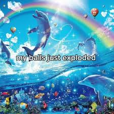

# The Cold Guerre

## Conférence de Yalta (en ex-Ukraine)

Février 1945

pas de victoire dans l'europe, pas de victoire dans le pacifique

On sait que la guerre va être gagnée. Hitler est cooked.

On réunit:
- URSS: Staline
- US: Roosevelt (va mourir en Avril)
- UK: Churchill

On va se partager l'europe:
- Est: communiste
- Ouest: Américaine

L'homme fort est Staline, Churchill comprend que Staline ne rendra rien et veut l'europe.

Churchill pousse Roosevelt a demander à Staline des elections libres dans les pays occupés.

Angleterre est la résistance principale aux Nazis

Les Etats-Unis financent pratiquement toute la guerre - c'est eux les vrais leaders finalement. Churchill est #2.

## Conférence de Potsdatt

Juillet 45

Entre jour VE et jour VP

Les nazis sont battus mais pas le Japonais.

- URSS: Staline
- US: Truman (successeur de Roosevelt, Democrate, no rizz)
- UK: Attlee (PM qui a battu Churchill au éléctions. Churchill est au pouvoir depuis Mai 1940. Il incarne la guerre. "I only promise one thing: blood, sweat, tears but victory." C'est une héros de guerre. C'est l'homme qui incarne la guerre. Mais les Anglais ne veulent pas la guerre, il veulent reconstruire l'Angleterre rasée. On veut du social plutot que de la politique et guerre. On votera travailliste.)

Churchill battu, Roosevelt mort, il ne reste plus que le moggeur Staline. Absolument toute la zone de conférence est truffée de micros.

Truman recoit un appel venu des états-unis qui lui dit "Manhattan operationnel". La larve de truman devient un papillon. Il a maintenant la bombe atomique.

Truman se bat encore dans le pacifique. Truman dit à Staline qu'il se fout de lui car il a pas attaqué le Japon comme promis. Le US va montrer ce qu'ils peuvent faire en guerre.

Au Japon ils avaient une peur folle des Americains. Les Americains aussi avaient peur du Japon. L'US pense autour d'un million de morts.

Truman recoit on a la bombe. Il menace le Japon. Puisque le Japon et Staline le prennent pour un bouffon, il lance la bombe sur Hiroshima - c'est le début d'une nouvèlle ère. Truman ne bluffait pas. L'armée rouge entre en guerre par hasard avec le Japon lalala. Deuxième bombe atomique - on montre qu'on en a en stock "Attention Staline sinon c'est toi qui te prend la troisième" - cette foit c'est du bluff. Entre 6 (Hiroshima (200k morts (sans long-terme) (bombardement incendiare = 300k morts))) et 9 (Nagasaki) Aout 1945 c'est là que la guerre froide commence.