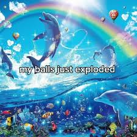

# The Cold Guerre

## Conférence de Yalta (en ex-Ukraine)

Février 1945

pas de victoire dans l'europe, pas de victoire dans le pacifique

On sait que la guerre va être gagnée. Hitler est cooked.

On réunit:
- URSS: Staline
- US: Roosevelt (va mourir en Avril)
- UK: Churchill

On va se partager l'europe:
- Est: communiste
- Ouest: Américaine

L'homme fort est Staline, Churchill comprend que Staline ne rendra rien et veut l'europe.

Churchill pousse Roosevelt a demander à Staline des elections libres dans les pays occupés.

Angleterre est la résistance principale aux Nazis

Les Etats-Unis financent pratiquement toute la guerre - c'est eux les vrais leaders finalement. Churchill est #2.

## Conférence de Potsdatt

Juillet 45

Entre jour VE et jour VP

Les nazis sont battus mais pas le Japonais.

- URSS: Staline
- US: Truman (successeur de Roosevelt, Democrate, no rizz)
- UK: Attlee (PM qui a battu Churchill au éléctions. Churchill est au pouvoir depuis Mai 1940. Il incarne la guerre. "I only promise one thing: blood, sweat, tears but victory." C'est une héros de guerre. C'est l'homme qui incarne la guerre. Mais les Anglais ne veulent pas la guerre, il veulent reconstruire l'Angleterre rasée. On veut du social plutot que de la politique et guerre. On votera travailliste.)

Churchill battu, Roosevelt mort, il ne reste plus que le moggeur Staline. Absolument toute la zone de conférence est truffée de micros.

Truman recoit un appel venu des états-unis qui lui dit "Manhattan operationnel". La larve de truman devient un papillon. Il a maintenant la bombe atomique.

Truman se bat encore dans le pacifique. Truman dit à Staline qu'il se fout de lui car il a pas attaqué le Japon comme promis. Le US va montrer ce qu'ils peuvent faire en guerre.

Au Japon ils avaient une peur folle des Americains. Les Americains aussi avaient peur du Japon. L'US pense autour d'un million de morts.

Truman recoit on a la bombe. Il menace le Japon. Puisque le Japon et Staline le prennent pour un bouffon, il lance la bombe sur Hiroshima - c'est le début d'une nouvèlle ère. Truman ne bluffait pas. L'armée rouge entre en guerre par hasard avec le Japon lalala. Deuxième bombe atomique - on montre qu'on en a en stock "Attention Staline sinon c'est toi qui te prend la troisième" - cette foit c'est du bluff. Entre 6 (Hiroshima (200k morts (sans long-terme) (bombardement incendiare = 300k morts))) et 9 (Nagasaki) Aout 1945 c'est là que la guerre froide commence.

## Entre-conférences

- Fevrier 45 conférence est pas finie
- Avril on est en alemagne, adolfe se suicide
- 8 Mai, jour VE, l'allemagne capitule, les alliés se repartagent l'allemagne, on organise le procès de Nuremberg. Une partie repart au pacifique.
- été Iroshima, Okinawa, etc
- Juillet, Okinawa plein de morts, suicide -> bombe atomique

## Guerre Froide

- Le principe de la GF c'est l'affrontement indirect (guerres asymétriques)
- en 1945 US domine, roi du monde
- en 1949 USSR a la bombe atomique
  - à partir de ce moment faut pas lancer et commencer l'apocalipse nucléaire.
- On se bat par peuple interposé
  - Au lieu on fait se battre des autres (Iran-Iraq, Corées, Vietnam-Russie)
  - Si un des deux pays s'engage, l'autre ni va pas.
    - Si les russes sont en Afghanistan, l'US arme les afghans.
- Début du guerilla warfare - tout est une arme
  - Asymmétrique: Armée conventionelle vs. peuple en armes. Les "civils" aussi se battent.
  - Peuples en arme avec idéologie derrière - une armée traditionelle ne gagne pas.

## Blocs

- Division allemagne
  - RFA (allemagne Ouest)
    - FR
    - US
    - UK
  - RDA
    - URSS
  - Berlin en plein territoire de l'est. Berlin divisé de la même manière.
  - Rideau de fer entre RFA et RDA (dès le début de GF ((46-)47))
  - Mur de berlin entoure RFA (1961-1983)
  - Mur construit par les Russes pour enpecher aux gens (et surotout les intellectuels) de s'échapper par la partie de Berlin de l'Ouest

## Grèce

Premier conflit de la guerre froide. La grèce a résisté aux allement (communistes). Guerre civile en grèce, britanniques pour la démocratie vs russes pour le communisme.

## Turquie

Le petit pays pro-américain super utile. Point stratégique.

## 1946

Satellisation  La pologne est envahie en 1939, les allement s'empares, gvt Polonais exilé à Londres. Quand ils ont voulu revenir, Staline a remit un gouvt. communiste. Les polonais se battent pour récupérer son pays. Les Polonais sont maintenant des communistes. gouvt. de Lublin, Staline dit qu'il a remit le Gvt. légitime en place, qui par coincidence est composé de Polonais communistes.
Tous ces pays deviennent des pays "satellites" qui sont soumis à la Russie.

## Fulton

Churchill dénonce le "rideau de fer".

## Random

Charles de Gaules (pas apprécie pas US) veut se faire légitimer par le peuple. En 1944, il a besoin de la population. La plupart des hommes sont rouges et ne votent pas pour moi. Ceux de l'armee sont en allemagne et ne voteront pas pour moi. Si qqn me votera, ce sera les femmes. Elles vont exprimer reconnaissance par leur vote. Il gagne.

On met toujours des "pions en opposition" et toujours bloquer les russes. (Doctrine Truman)

Les russes utilisent la Doctrine Djanov

L'est est pratiquement toujours dans la réaction plutot que dans la réaction. Le provocateur c'est les états-unis.

L'US donne masse thune à offrir aux pays Européens pour qu'ils ne deviennent pas communistes. (Plan Marshall)

Tous les partis communistes d'europe viennent prendre leur ordres à Moscou.

Les Chinois suivent le modèle Russe mais depuis la crise de cuba en 1962 la chine se sépare.

## Idk

Tonkin Annam Cochinchine forment le Vietnam

Les japonais veulent indonésie et malaysie. Sur le chemin y'a l'indochine. L'indochine est allemande après la défaite de la France, ils laissent passer les japonais et ils occupent l'indochine francaise.
Vietminh - guerilla : proclament l'independance du vietnam Septembre 45.
La france envoie un petit corps expeditionnaire en indochine en 46. On s'instale a Saygon et on prend le Sud, le Nord est communiste. Au Nord le vietminh est sponsorisé par les russes en 46 et en 49 par les chinois, armés par les russes. C'est une guerre de tranchées dans la jungle, c'est un yapfest.
Dien.Bien-Phu -> camp fortifié Francais, mais qui était au fond d'une valée. En 54 on perd l'indochine.
54 on perd, on divise le vietnam en 2. Les Français se retirent. Americains (65) viennent sponsoriser le Sud pour ne pas tomber à la menace communiste du Nord.

# Creation de l'etat d'Israël

## Sionisme
l' idée que les juifs doivent avoir leur propre état (Palestine) où on trouve les lieux saints.

Dernier mur du temple de Salomon

## idk

premiere guerre mondiale: c'était aux ottomans

Brit souleve des arabes pour destabiliser les ottomans. On essaie de rallier les juifs aussi, qui a promis: la création d'un état juif

Puis les anglais occupent la palestine et ignorent la promesse.

20s

crise économique, montée des partis fascistes et nazis: politique antisémite: les juifs veulent leur état juif.

Ashtenaz: juifs allemands et de l'est, ils parlent: le yiddish

Les arabes vendent leur terre aux juifs.

hagana: groupe paramilitaire (ancetre de l'armee israelienne).

1947 l'ONU auquel a étée rendue la terre par l'angleterre fait une division un peu farfadesque.
