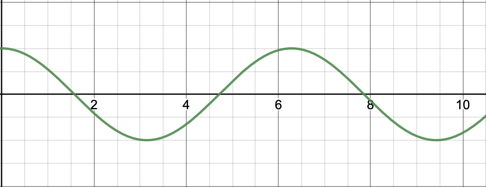
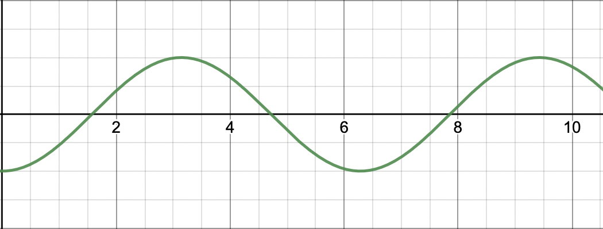
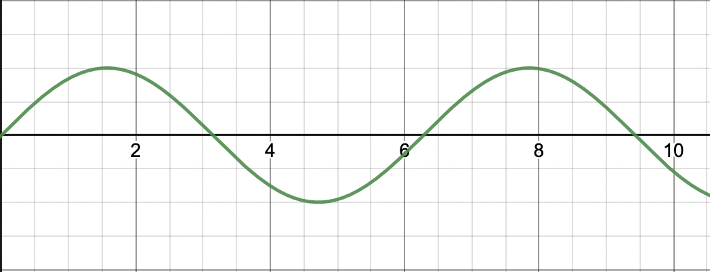

```
x(t) = Xm * cos(wt + 0)
v(t) = -Xm * w * sin(2t + 0)
a(t) = -Xm * w² * cos(wt + 0)

Xm = Amplitude
w  = fréquence angulaire
0  = déphasage

w = 2pi / t
```
```
Frap = -k * x
a = -w * x
F = ma

w = racine(k/m)

Frap = Force de rappel
k    = raideur
a    = accélération
```

# Test

## Champ de révision

- Retrouver l'équation différentielle des oscillateurs
- Etudier l'équation qui décrit le mouvement harmonique simple (MHS) pour la position, la vitesse et l'accélération
- Retrouver la phase à l'origine, et l'amplitude de la position, de la vitesse et de l'accélération
- Résoudre des problèmes avec les cas : ressort horizontal, ressort vertical et pendule
- Reconnaitre les 3 régimes d'oscillation amortie

## Equations des oscillateurs

$x(t) = A * cos(\omega t + \phi)$

$v(t) = -A * \omega * sin(\omega t + \phi)$

$a(t) = -A * \omega² * cos(\omega t + \phi)$

## Méthode de Résolution pour prouver qu'un système est oscillateur

- Bilan des forces
- $F = ma$
- On cherche à optenir $a = -w^2 * x$
  - On retrouve $\omega$ par identification
- On a une position: $x(t) = A * cos(wt + \phi)$
  - Avec A = amplitude, distance entre position x maximale et position x en équilibre.
  - $\phi$ = la phase

## Phase à l'origine

**/!\ Pour la fonction cosinus**

$\phi = 0$

$x(0) = A$



$\phi = \frac{\pi}{2}$

$x(0) = 0$


$\phi = \pi$

$x(0) = -A$



$\phi = -\frac{\pi}{2}$

$x(0) = 0$



